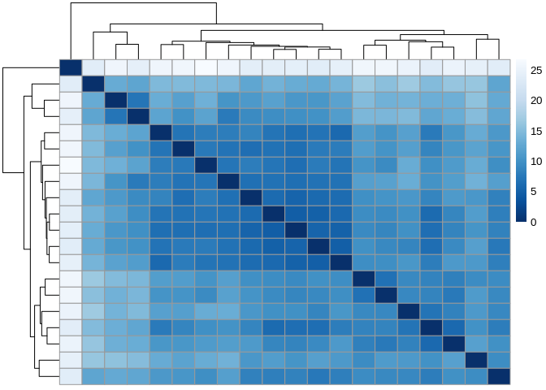
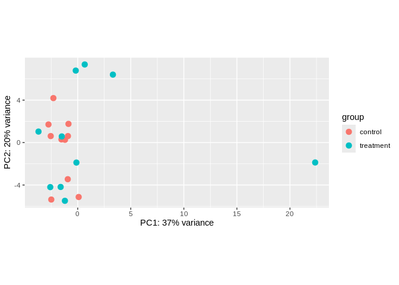
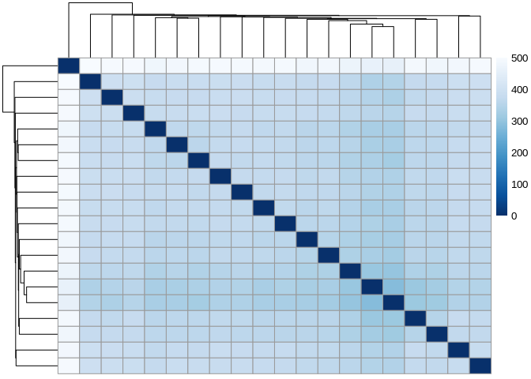
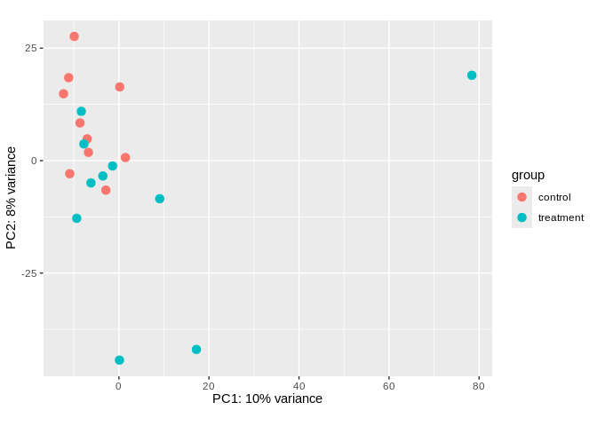
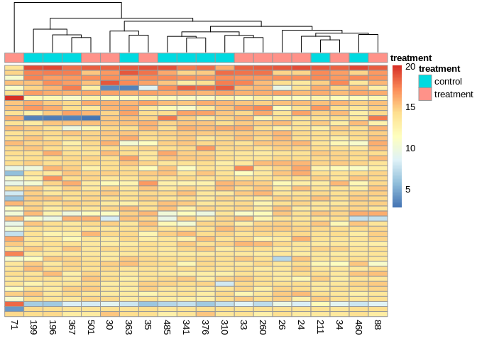

03.00-sRNAseq-gene-expression-DESeq2
================
Sam White
2025-01-31

- <a href="#1-background" id="toc-1-background">1 Background</a>
  - <a href="#11-inputs" id="toc-11-inputs">1.1 Inputs</a>
  - <a href="#12-outputs" id="toc-12-outputs">1.2 Outputs</a>
- <a href="#2-set-r-variables" id="toc-2-set-r-variables">2 Set R
  variables</a>
- <a href="#3-load-count-data" id="toc-3-load-count-data">3 Load count
  data</a>
  - <a href="#31-select-only-mirnas-idd-by-shortstack"
    id="toc-31-select-only-mirnas-idd-by-shortstack">3.1 Select only miRNAs
    IDd by ShortStack</a>
  - <a href="#32-all-srna-seq-counts" id="toc-32-all-srna-seq-counts">3.2
    All sRNA-seq counts</a>
- <a href="#4-create-deseq2-column-data"
  id="toc-4-create-deseq2-column-data">4 Create DESeq2 Column Data</a>
  - <a href="#41-read-in-metadata-csv" id="toc-41-read-in-metadata-csv">4.1
    Read in metadata CSV</a>
  - <a href="#42-extract-sample-names" id="toc-42-extract-sample-names">4.2
    Extract sample names</a>
  - <a href="#43-select-sample-name-and-treatment"
    id="toc-43-select-sample-name-and-treatment">4.3 Select sample name and
    treatment</a>
  - <a href="#44-write-deseq-coldata-to-file"
    id="toc-44-write-deseq-coldata-to-file">4.4 Write DEseq coldata to
    file</a>
- <a href="#5-shortstack-mirnas" id="toc-5-shortstack-mirnas">5 SHORTSTACK
  miRNAS</a>
  - <a href="#51-count-data-munging" id="toc-51-count-data-munging">5.1
    Count data munging</a>
    - <a href="#511-fix-col-names-and-convert-to-matrix"
      id="toc-511-fix-col-names-and-convert-to-matrix">5.1.1 Fix col names and
      convert to matrix</a>
    - <a href="#512-take-only-samples-present-in-coldata"
      id="toc-512-take-only-samples-present-in-coldata">5.1.2 Take only
      samples present in coldata</a>
    - <a href="#513-reorder-matrix-cols-to-match-coldata"
      id="toc-513-reorder-matrix-cols-to-match-coldata">5.1.3 Reorder matrix
      cols to match coldata</a>
    - <a href="#514-verify-rownames-match"
      id="toc-514-verify-rownames-match">5.1.4 Verify rownames match</a>
  - <a href="#52-create-deseq2-data-set"
    id="toc-52-create-deseq2-data-set">5.2 Create DESeq2 data set</a>
    - <a href="#521-initialize-deseq2-data-set"
      id="toc-521-initialize-deseq2-data-set">5.2.1 Initialize DEseq2 data
      set</a>
    - <a href="#522-add-cluster-column-as-gene-feature"
      id="toc-522-add-cluster-column-as-gene-feature">5.2.2 Add cluster column
      as “gene” feature</a>
    - <a href="#523-set-factor-levels" id="toc-523-set-factor-levels">5.2.3
      Set factor levels</a>
  - <a href="#53-deseq-analysis" id="toc-53-deseq-analysis">5.3 DESeq
    analysis</a>
    - <a href="#531-deseq" id="toc-531-deseq">5.3.1 DEseq</a>
    - <a href="#532-deseq-results" id="toc-532-deseq-results">5.3.2 DEseq
      Results</a>
    - <a href="#533-write-dds-results-tables-to-csvs"
      id="toc-533-write-dds-results-tables-to-csvs">5.3.3 Write DDS results
      tables to CSVs</a>
    - <a href="#534-identify-differentially-expressed-mirnas"
      id="toc-534-identify-differentially-expressed-mirnas">5.3.4 Identify
      Differentially Expressed miRNAs</a>
  - <a href="#54-variance-stabilizing-transformations-vst"
    id="toc-54-variance-stabilizing-transformations-vst">5.4 Variance
    stabilizing transformations (VST)</a>
  - <a href="#55-plotting" id="toc-55-plotting">5.5 Plotting</a>
    - <a href="#551-sample-distances" id="toc-551-sample-distances">5.5.1
      Sample distances</a>
    - <a href="#552-pca" id="toc-552-pca">5.5.2 PCA</a>
    - <a href="#553-heatmap-of-37-shortstack-mirnas"
      id="toc-553-heatmap-of-37-shortstack-mirnas">5.5.3 Heatmap of 37
      ShortStack miRNAs</a>
- <a href="#6-all-srna" id="toc-6-all-srna">6 ALL sRNA</a>
  - <a href="#61-count-data-munging" id="toc-61-count-data-munging">6.1
    Count data munging</a>
    - <a href="#611-fix-col-names-and-convert-to-matrix"
      id="toc-611-fix-col-names-and-convert-to-matrix">6.1.1 Fix col names and
      convert to matrix</a>
    - <a href="#612-take-only-samples-present-in-coldata"
      id="toc-612-take-only-samples-present-in-coldata">6.1.2 Take only
      samples present in coldata</a>
    - <a href="#613-reorder-matrix-cols-to-match-coldata"
      id="toc-613-reorder-matrix-cols-to-match-coldata">6.1.3 Reorder matrix
      cols to match coldata</a>
    - <a href="#614-verify-rownames-match"
      id="toc-614-verify-rownames-match">6.1.4 Verify rownames match</a>
  - <a href="#62-create-deseq2-data-set"
    id="toc-62-create-deseq2-data-set">6.2 Create DESeq2 data set</a>
    - <a href="#621-initialize-deseq2-data-set"
      id="toc-621-initialize-deseq2-data-set">6.2.1 Initialize DEseq2 data
      set</a>
    - <a href="#622-add-cluster-column-as-gene-feature"
      id="toc-622-add-cluster-column-as-gene-feature">6.2.2 Add cluster column
      as “gene” feature</a>
    - <a href="#623-set-factor-levels" id="toc-623-set-factor-levels">6.2.3
      Set factor levels</a>
  - <a href="#63-deseq-analysis" id="toc-63-deseq-analysis">6.3 DESeq
    analysis</a>
    - <a href="#631-deseq" id="toc-631-deseq">6.3.1 DEseq</a>
    - <a href="#632-deseq-results" id="toc-632-deseq-results">6.3.2 DEseq
      Results</a>
    - <a href="#633-write-dds-results-tables-to-csvs"
      id="toc-633-write-dds-results-tables-to-csvs">6.3.3 Write DDS results
      tables to CSVs</a>
    - <a href="#634-identify-differentially-expressed-srnas"
      id="toc-634-identify-differentially-expressed-srnas">6.3.4 Identify
      Differentially Expressed sRNAs</a>
  - <a href="#64-variance-stabilizing-transformations-vst"
    id="toc-64-variance-stabilizing-transformations-vst">6.4 Variance
    stabilizing transformations (VST)</a>
  - <a href="#65-plotting" id="toc-65-plotting">6.5 Plotting</a>
    - <a href="#651-sample-distances" id="toc-651-sample-distances">6.5.1
      Sample distances</a>
    - <a href="#652-pca" id="toc-652-pca">6.5.2 PCA</a>
    - <a href="#653-heatmap-of-top-50-srnas"
      id="toc-653-heatmap-of-top-50-srnas">6.5.3 Heatmap of Top 50 sRNAs</a>
- <a href="#7-references" id="toc-7-references">7 REFERENCES</a>

# 1 Background

This will run
[DEseq2](https://bioconductor.org/packages/release/bioc/vignettes/DESeq2/inst/doc/DESeq2.html)
(Love, Huber, and Anders 2014) to determine if any of the miRNAs
identified by ShortStack in
[02.00-ShortStack-31bp-fastp-merged.md](https://github.com/RobertsLab/project-clam-oa/blob/2616d45a5a0bbef23081c5824bfe5bad6b89d227/code/02.00-ShortStack-31bp-fastp-merged.md)
analysis are differentially expressed between control/treatment.

This was initially run with a log2 fold change threshold set to 1 (which
is equivalent to a 2-fold change in expression), but that returned 0
differentially expressed miRNAs. As such, this was run again with the
log2 fold change threshold set to 0.

<div class="callout-note">

ShortStack identified 37 miRNAs.

</div>

This notebook will also run
[DEseq2](https://bioconductor.org/packages/release/bioc/vignettes/DESeq2/inst/doc/DESeq2.html)
(Love, Huber, and Anders 2014) on *all* sRNAs to identify any
differential expression.

<div class="callout-important">

This includes the 37 miRNAs identified by ShortStack.

</div>

## 1.1 Inputs

- [`Counts.txt`](https://github.com/RobertsLab/project-clam-oa/blob/d380ed9a88c874db5434c9ec74f6ab1de042bad5/output/02.00-ShortStack-31bp-fastp-merged/ShortStack_out/Counts.txt):
  ShortStack counts matrix. Includes all clusters, including those that
  were *not* categorized as miRNAs.

- [`DESeq2-coldata.tab`](https://github.com/RobertsLab/project-clam-oa/blob/d380ed9a88c874db5434c9ec74f6ab1de042bad5/output/03.00-sRNAseq-gene-expression-DESeq2/DESeq2-coldata.tab):
  Two column table with sample ID and treatment. This file is also an
  output from this notebook.

- [ManilaOA2023_shortRNASeq_Meta.csv](https://github.com/RobertsLab/project-clam-oa/blob/d380ed9a88c874db5434c9ec74f6ab1de042bad5/data/ManilaOA2023_shortRNASeq_Meta.csv):
  Metadata file for this sRNA-seq data.

## 1.2 Outputs

- [`DE-miRNAs.fdr-0.05.lfc-0.tab`](https://github.com/RobertsLab/project-clam-oa/blob/3a9131cc5af82e756990d735b1ad56aecc32008c/output/03.00-sRNAseq-gene-expression-DESeq2/DE-miRNAs.fdr-0.05.lfc-0.tab):
  Tab-delimited list of differentially expressed miRNA “clusters” from
  the ShortStack `Results.txt` file.

- [`DE-sRNAs.fdr-0.05.lfc-0.tab`](https://github.com/RobertsLab/project-clam-oa/blob/3a9131cc5af82e756990d735b1ad56aecc32008c/output/03.00-sRNAseq-gene-expression-DESeq2/DE-sRNAs.fdr-0.05.lfc-0.tab):
  Tab-delimited list of differentially expressed sRNA “clusters” from
  the ShortStack `Results.txt` file. Since this is any sRNA, results may
  also include miRNAs identified by ShortStack.

- [`DESeq2-coldata.tab`](https://github.com/RobertsLab/project-clam-oa/blob/3a9131cc5af82e756990d735b1ad56aecc32008c/output/03.00-sRNAseq-gene-expression-DESeq2/DESeq2-coldata.tab):
  Two column table with sample ID and treatment. Needed as input to
  DEseq2.

- [`deseq2.miRNAs.fdr-0.05.lfc-0.table.csv`](https://github.com/RobertsLab/project-clam-oa/blob/3a9131cc5af82e756990d735b1ad56aecc32008c/output/03.00-sRNAseq-gene-expression-DESeq2/deseq2.miRNAs.fdr-0.05.lfc-0.table.csv):
  DEseq2 miRNA output table of results with adjusted p-value \<= 0.05
  and a log<sub>2</sub> fold change value = 0.

- [`deseq2.miRNAs.table.csv`](https://github.com/RobertsLab/project-clam-oa/blob/3a9131cc5af82e756990d735b1ad56aecc32008c/output/03.00-sRNAseq-gene-expression-DESeq2/deseq2.miRNAs.table.csv):
  Unfiltered DEseq2 miRNA output table containing all results with mean
  expression, fold change in expression, and adjusted p-values for all
  input samples.

- [`deseq2.sRNAs.fdr-0.05.lfc-0.table.csv`](https://github.com/RobertsLab/project-clam-oa/blob/3a9131cc5af82e756990d735b1ad56aecc32008c/output/03.00-sRNAseq-gene-expression-DESeq2/deseq2.sRNAs.fdr-0.05.lfc-0.table.csv):
  DEseq2 sRNA output table of results with adjusted p-value \<= 0.05 and
  a log<sub>2</sub> fold change value = 0.

- [`deseq2.sRNAs.table.csv`](https://github.com/RobertsLab/project-clam-oa/blob/3a9131cc5af82e756990d735b1ad56aecc32008c/output/03.00-sRNAseq-gene-expression-DESeq2/deseq2.sRNAs.table.csv):
  Unfiltered DEseq2 sRNA output table containing all results with mean
  expression, fold change in expression, and adjusted p-values for all
  input samples.

# 2 Set R variables

``` r
# Define the output directory path
output_dir <- "../output/03.00-sRNAseq-gene-expression-DESeq2/"

# Set desired false discovery rate threshold (i.e. adjusted p-value, padj)
fdr <- 0.05

# Set log2 fold change threshold (a value of '1' is equal to a fold change of '2')
log2fc <- 0
```

# 3 Load count data

Load in the sRNA count matrix generated using ShortStack 4.1.1. Keep in
mind this data includes counts of all sRNAs, not just miRNAs.

Counts generated in `02.00-ShortStack-31bp-fastp-merged`.

## 3.1 Select only miRNAs IDd by ShortStack

``` r
# Read in sRNA counts data
miRNA_seq_counts_shortstack <- read_delim("../output/02.00-ShortStack-31bp-fastp-merged/ShortStack_out/Counts.txt", delim="\t")

miRNA_seq_counts_shortstack <- miRNA_seq_counts_shortstack %>% filter(MIRNA == "Y")

str(miRNA_seq_counts_shortstack)
```

    spc_tbl_ [37 × 23] (S3: spec_tbl_df/tbl_df/tbl/data.frame)
     $ Coords                                        : chr [1:37] "NW_026852415.1:231396-231495" "NW_026852524.1:285406-285505" "NW_026852815.1:56435-56532" "NW_026853363.1:213466-213568" ...
     $ Name                                          : chr [1:37] "Cluster_1785" "Cluster_2042" "Cluster_2646" "Cluster_3720" ...
     $ MIRNA                                         : chr [1:37] "Y" "Y" "Y" "Y" ...
     $ 196-fastp-adapters-polyG-31bp-merged_condensed: num [1:37] 693 108457 1808 37 9 ...
     $ 199-fastp-adapters-polyG-31bp-merged_condensed: num [1:37] 503 137906 1592 24 4 ...
     $ 211-fastp-adapters-polyG-31bp-merged_condensed: num [1:37] 663 154248 2026 23 2 ...
     $ 24-fastp-adapters-polyG-31bp-merged_condensed : num [1:37] 557 136805 1276 34 8 ...
     $ 260-fastp-adapters-polyG-31bp-merged_condensed: num [1:37] 1419 120261 1468 178 8 ...
     $ 26-fastp-adapters-polyG-31bp-merged_condensed : num [1:37] 559 124995 1580 29 0 ...
     $ 30-fastp-adapters-polyG-31bp-merged_condensed : num [1:37] 780 157279 2265 19 4 ...
     $ 310-fastp-adapters-polyG-31bp-merged_condensed: num [1:37] 569 154690 1765 15 2 ...
     $ 33-fastp-adapters-polyG-31bp-merged_condensed : num [1:37] 442 116913 1420 13 9 ...
     $ 341-fastp-adapters-polyG-31bp-merged_condensed: num [1:37] 728 121161 1344 7 2 ...
     $ 34-fastp-adapters-polyG-31bp-merged_condensed : num [1:37] 665 143730 1736 14 5 ...
     $ 35-fastp-adapters-polyG-31bp-merged_condensed : num [1:37] 607 128534 1683 26 1 ...
     $ 363-fastp-adapters-polyG-31bp-merged_condensed: num [1:37] 538 95266 1408 15 6 ...
     $ 367-fastp-adapters-polyG-31bp-merged_condensed: num [1:37] 520 119389 1315 7 1 ...
     $ 376-fastp-adapters-polyG-31bp-merged_condensed: num [1:37] 1029 217736 2833 14 2 ...
     $ 460-fastp-adapters-polyG-31bp-merged_condensed: num [1:37] 571 139439 1466 9 6 ...
     $ 485-fastp-adapters-polyG-31bp-merged_condensed: num [1:37] 579 154776 1747 11 4 ...
     $ 501-fastp-adapters-polyG-31bp-merged_condensed: num [1:37] 1182 167181 2135 174 3 ...
     $ 71-fastp-adapters-polyG-31bp-merged_condensed : num [1:37] 392 1097 11123 1248 5 ...
     $ 88-fastp-adapters-polyG-31bp-merged_condensed : num [1:37] 552 136133 1808 9 1 ...
     - attr(*, "spec")=
      .. cols(
      ..   Coords = col_character(),
      ..   Name = col_character(),
      ..   MIRNA = col_character(),
      ..   `196-fastp-adapters-polyG-31bp-merged_condensed` = col_double(),
      ..   `199-fastp-adapters-polyG-31bp-merged_condensed` = col_double(),
      ..   `211-fastp-adapters-polyG-31bp-merged_condensed` = col_double(),
      ..   `24-fastp-adapters-polyG-31bp-merged_condensed` = col_double(),
      ..   `260-fastp-adapters-polyG-31bp-merged_condensed` = col_double(),
      ..   `26-fastp-adapters-polyG-31bp-merged_condensed` = col_double(),
      ..   `30-fastp-adapters-polyG-31bp-merged_condensed` = col_double(),
      ..   `310-fastp-adapters-polyG-31bp-merged_condensed` = col_double(),
      ..   `33-fastp-adapters-polyG-31bp-merged_condensed` = col_double(),
      ..   `341-fastp-adapters-polyG-31bp-merged_condensed` = col_double(),
      ..   `34-fastp-adapters-polyG-31bp-merged_condensed` = col_double(),
      ..   `35-fastp-adapters-polyG-31bp-merged_condensed` = col_double(),
      ..   `363-fastp-adapters-polyG-31bp-merged_condensed` = col_double(),
      ..   `367-fastp-adapters-polyG-31bp-merged_condensed` = col_double(),
      ..   `376-fastp-adapters-polyG-31bp-merged_condensed` = col_double(),
      ..   `460-fastp-adapters-polyG-31bp-merged_condensed` = col_double(),
      ..   `485-fastp-adapters-polyG-31bp-merged_condensed` = col_double(),
      ..   `501-fastp-adapters-polyG-31bp-merged_condensed` = col_double(),
      ..   `71-fastp-adapters-polyG-31bp-merged_condensed` = col_double(),
      ..   `88-fastp-adapters-polyG-31bp-merged_condensed` = col_double()
      .. )
     - attr(*, "problems")=<externalptr> 

## 3.2 All sRNA-seq counts

``` r
# Read in sRNA counts data
srna_seq_counts_all <- read_delim("../output/02.00-ShortStack-31bp-fastp-merged/ShortStack_out/Counts.txt", delim="\t")

str(srna_seq_counts_all)
```

    spc_tbl_ [33,666 × 23] (S3: spec_tbl_df/tbl_df/tbl/data.frame)
     $ Coords                                        : chr [1:33666] "NW_026851514.1:11444-11873" "NW_026851514.1:12401-12830" "NW_026851515.1:76365-77030" "NW_026851515.1:77089-77506" ...
     $ Name                                          : chr [1:33666] "Cluster_1" "Cluster_2" "Cluster_3" "Cluster_4" ...
     $ MIRNA                                         : chr [1:33666] "N" "N" "N" "N" ...
     $ 196-fastp-adapters-polyG-31bp-merged_condensed: num [1:33666] 39 33 179 34 279 68 28 233 40 0 ...
     $ 199-fastp-adapters-polyG-31bp-merged_condensed: num [1:33666] 14 24 7 0 12 2 0 11 1 1 ...
     $ 211-fastp-adapters-polyG-31bp-merged_condensed: num [1:33666] 214 40 979 31 401 35 106 492 56 0 ...
     $ 24-fastp-adapters-polyG-31bp-merged_condensed : num [1:33666] 102 35 311 10 111 16 43 74 15 0 ...
     $ 260-fastp-adapters-polyG-31bp-merged_condensed: num [1:33666] 39 21 132 1 123 21 5 124 23 2 ...
     $ 26-fastp-adapters-polyG-31bp-merged_condensed : num [1:33666] 0 0 808 87 388 20 8 827 215 0 ...
     $ 30-fastp-adapters-polyG-31bp-merged_condensed : num [1:33666] 12 7 448 21 165 26 39 117 38 3 ...
     $ 310-fastp-adapters-polyG-31bp-merged_condensed: num [1:33666] 43 13 857 25 153 0 5 165 3 2 ...
     $ 33-fastp-adapters-polyG-31bp-merged_condensed : num [1:33666] 1 1 320 26 225 24 35 177 97 3 ...
     $ 341-fastp-adapters-polyG-31bp-merged_condensed: num [1:33666] 220 41 671 7 110 19 4 92 32 0 ...
     $ 34-fastp-adapters-polyG-31bp-merged_condensed : num [1:33666] 34 32 1413 28 795 ...
     $ 35-fastp-adapters-polyG-31bp-merged_condensed : num [1:33666] 103 40 497 24 126 57 37 116 29 3 ...
     $ 363-fastp-adapters-polyG-31bp-merged_condensed: num [1:33666] 60 16 833 117 441 89 45 827 200 0 ...
     $ 367-fastp-adapters-polyG-31bp-merged_condensed: num [1:33666] 40 132 426 6 127 23 19 122 127 0 ...
     $ 376-fastp-adapters-polyG-31bp-merged_condensed: num [1:33666] 0 16 2409 187 978 ...
     $ 460-fastp-adapters-polyG-31bp-merged_condensed: num [1:33666] 3 0 331 17 149 40 41 260 28 2 ...
     $ 485-fastp-adapters-polyG-31bp-merged_condensed: num [1:33666] 5 42 5 0 42 4 4 106 2 0 ...
     $ 501-fastp-adapters-polyG-31bp-merged_condensed: num [1:33666] 4 1 363 6 76 ...
     $ 71-fastp-adapters-polyG-31bp-merged_condensed : num [1:33666] 0 0 31 123 671 37 2 691 135 0 ...
     $ 88-fastp-adapters-polyG-31bp-merged_condensed : num [1:33666] 1 41 633 48 354 45 52 200 77 0 ...
     - attr(*, "spec")=
      .. cols(
      ..   Coords = col_character(),
      ..   Name = col_character(),
      ..   MIRNA = col_character(),
      ..   `196-fastp-adapters-polyG-31bp-merged_condensed` = col_double(),
      ..   `199-fastp-adapters-polyG-31bp-merged_condensed` = col_double(),
      ..   `211-fastp-adapters-polyG-31bp-merged_condensed` = col_double(),
      ..   `24-fastp-adapters-polyG-31bp-merged_condensed` = col_double(),
      ..   `260-fastp-adapters-polyG-31bp-merged_condensed` = col_double(),
      ..   `26-fastp-adapters-polyG-31bp-merged_condensed` = col_double(),
      ..   `30-fastp-adapters-polyG-31bp-merged_condensed` = col_double(),
      ..   `310-fastp-adapters-polyG-31bp-merged_condensed` = col_double(),
      ..   `33-fastp-adapters-polyG-31bp-merged_condensed` = col_double(),
      ..   `341-fastp-adapters-polyG-31bp-merged_condensed` = col_double(),
      ..   `34-fastp-adapters-polyG-31bp-merged_condensed` = col_double(),
      ..   `35-fastp-adapters-polyG-31bp-merged_condensed` = col_double(),
      ..   `363-fastp-adapters-polyG-31bp-merged_condensed` = col_double(),
      ..   `367-fastp-adapters-polyG-31bp-merged_condensed` = col_double(),
      ..   `376-fastp-adapters-polyG-31bp-merged_condensed` = col_double(),
      ..   `460-fastp-adapters-polyG-31bp-merged_condensed` = col_double(),
      ..   `485-fastp-adapters-polyG-31bp-merged_condensed` = col_double(),
      ..   `501-fastp-adapters-polyG-31bp-merged_condensed` = col_double(),
      ..   `71-fastp-adapters-polyG-31bp-merged_condensed` = col_double(),
      ..   `88-fastp-adapters-polyG-31bp-merged_condensed` = col_double()
      .. )
     - attr(*, "problems")=<externalptr> 

# 4 Create DESeq2 Column Data

## 4.1 Read in metadata CSV

``` r
# Load metadata
metadata <- read.csv("../data/ManilaOA2023_shortRNASeq_Meta.csv", header = TRUE)

str(metadata)
```

    'data.frame':   20 obs. of  6 variables:
     $ ID_simple  : int  196 199 211 310 341 363 367 376 460 485 ...
     $ treatment  : chr  "control" "control" "control" "control" ...
     $ Sex        : logi  FALSE FALSE FALSE FALSE FALSE FALSE ...
     $ MeanEggArea: int  NA 3687 3519 3795 3837 3749 NA 3834 3759 NA ...
     $ Species    : chr  "Manila clam" "Manila clam" "Manila clam" "Manila clam" ...
     $ LifeStage  : chr  "Adult" "Adult" "Adult" "Adult" ...

## 4.2 Extract sample names

``` r
sample_names <- colnames(miRNA_seq_counts_shortstack) %>%
  str_subset("^\\d+-") %>%
  str_extract("^\\d+")

str(sample_names)
```

     chr [1:20] "196" "199" "211" "24" "260" "26" "30" "310" "33" "341" "34" ...

## 4.3 Select sample name and treatment

``` r
sample_treatment_df <- metadata %>%
  select(ID_simple, treatment)

# Set sample names as rownames
rownames(sample_treatment_df) <- sample_treatment_df$ID_simple

sample_treatment_df$ID_simple <- NULL

str(sample_treatment_df)
```

    'data.frame':   20 obs. of  1 variable:
     $ treatment: chr  "control" "control" "control" "control" ...

## 4.4 Write DEseq coldata to file

``` r
write.table(
  sample_treatment_df,
  file = "../output/03.00-sRNAseq-gene-expression-DESeq2/DESeq2-coldata.tab",
  sep = "\t",
  quote = FALSE,
  col.names = NA
)
```

# 5 SHORTSTACK miRNAS

## 5.1 Count data munging

### 5.1.1 Fix col names and convert to matrix

``` r
coldata <- sample_treatment_df

# Remove excess portions of sample column names to just "sample###"
colnames(miRNA_seq_counts_shortstack) <- sub("-fastp-adapters-polyG-31bp-merged_condensed", "", colnames(miRNA_seq_counts_shortstack))

# Keep just the counts and cluster names as matrix
miRNA_seq_counts_matrix <- as.matrix(miRNA_seq_counts_shortstack %>% select(-Coords, -MIRNA) %>% column_to_rownames(var = "Name"))

str(miRNA_seq_counts_matrix)
```

     num [1:37, 1:20] 693 108457 1808 37 9 ...
     - attr(*, "dimnames")=List of 2
      ..$ : chr [1:37] "Cluster_1785" "Cluster_2042" "Cluster_2646" "Cluster_3720" ...
      ..$ : chr [1:20] "196" "199" "211" "24" ...

### 5.1.2 Take only samples present in coldata

``` r
miRNA_common_cols <- intersect(colnames(miRNA_seq_counts_matrix),
                         rownames(sample_treatment_df))

miRNA_seq_counts_matrix <- miRNA_seq_counts_matrix[, miRNA_common_cols]

str(miRNA_seq_counts_matrix)
```

     num [1:37, 1:20] 693 108457 1808 37 9 ...
     - attr(*, "dimnames")=List of 2
      ..$ : chr [1:37] "Cluster_1785" "Cluster_2042" "Cluster_2646" "Cluster_3720" ...
      ..$ : chr [1:20] "196" "199" "211" "24" ...

### 5.1.3 Reorder matrix cols to match coldata

``` r
miRNA_ord <- match(rownames(sample_treatment_df), colnames(miRNA_seq_counts_matrix))

miRNA_seq_counts_matrix_sorted <- miRNA_seq_counts_matrix[, miRNA_ord]

str(miRNA_seq_counts_matrix_sorted)
```

     num [1:37, 1:20] 693 108457 1808 37 9 ...
     - attr(*, "dimnames")=List of 2
      ..$ : chr [1:37] "Cluster_1785" "Cluster_2042" "Cluster_2646" "Cluster_3720" ...
      ..$ : chr [1:20] "196" "199" "211" "310" ...

### 5.1.4 Verify rownames match

``` r
all(rownames(coldata) == colnames(miRNA_seq_counts_matrix_sorted))
```

    [1] TRUE

## 5.2 Create DESeq2 data set

### 5.2.1 Initialize DEseq2 data set

``` r
miRNA_dds <- DESeqDataSetFromMatrix(countData = miRNA_seq_counts_matrix_sorted,
                              colData = coldata,
                              design = ~ treatment)
miRNA_dds
```

    class: DESeqDataSet 
    dim: 37 20 
    metadata(1): version
    assays(1): counts
    rownames(37): Cluster_1785 Cluster_2042 ... Cluster_32918 Cluster_32919
    rowData names(0):
    colnames(20): 196 199 ... 71 260
    colData names(1): treatment

### 5.2.2 Add cluster column as “gene” feature

``` r
miRNA_featureData <- data.frame(gene=rownames(miRNA_seq_counts_matrix_sorted))
mcols(miRNA_dds) <- DataFrame(mcols(miRNA_dds), miRNA_featureData)
mcols(miRNA_dds)
```

    DataFrame with 37 rows and 1 column
                           gene
                    <character>
    Cluster_1785   Cluster_1785
    Cluster_2042   Cluster_2042
    Cluster_2646   Cluster_2646
    Cluster_3720   Cluster_3720
    Cluster_4396   Cluster_4396
    ...                     ...
    Cluster_29018 Cluster_29018
    Cluster_31844 Cluster_31844
    Cluster_32917 Cluster_32917
    Cluster_32918 Cluster_32918
    Cluster_32919 Cluster_32919

### 5.2.3 Set factor levels

``` r
miRNA_dds$treatment <- factor(miRNA_dds$treatment, levels = c("control", "treatment"))
```

## 5.3 DESeq analysis

### 5.3.1 DEseq

``` r
miRNA_dds <- DESeq(miRNA_dds)
```

### 5.3.2 DEseq Results

``` r
miRNA_res <- results(miRNA_dds, alpha = fdr, lfcThreshold = log2fc)

miRNA_res
```

    log2 fold change (MLE): treatment treatment vs control 
    Wald test p-value: treatment treatment vs control 
    DataFrame with 37 rows and 6 columns
                     baseMean log2FoldChange     lfcSE       stat      pvalue
                    <numeric>      <numeric> <numeric>  <numeric>   <numeric>
    Cluster_1785  6.63895e+02      0.0149611 0.2810643  0.0532301 0.957548604
    Cluster_2042  1.35312e+05     -0.1901409 0.4840889 -0.3927810 0.694481249
    Cluster_2646  1.76900e+03      0.0185890 0.0902545  0.2059620 0.836820596
    Cluster_3720  4.26842e+01      2.0921221 0.5504186  3.8009659 0.000144133
    Cluster_4396  4.09498e+00      0.0360325 0.5609930  0.0642299 0.948787181
    ...                   ...            ...       ...        ...         ...
    Cluster_29018   1661.6392      2.4245029  0.683762   3.545830 0.000391378
    Cluster_31844   1372.1080     -0.0477386  0.146375  -0.326140 0.744318793
    Cluster_32917     14.7573      0.2194667  0.377211   0.581814 0.560691835
    Cluster_32918   1259.4586      0.5004769  0.370048   1.352466 0.176226232
    Cluster_32919      4.5894      0.2954022  0.619287   0.477004 0.633359369
                        padj
                   <numeric>
    Cluster_1785  0.98414718
    Cluster_2042  0.94314745
    Cluster_2646  0.96982079
    Cluster_3720  0.00482699
    Cluster_4396  0.98414718
    ...                  ...
    Cluster_29018 0.00482699
    Cluster_31844 0.94964812
    Cluster_32917 0.94314745
    Cluster_32918 0.57114000
    Cluster_32919 0.94314745

``` r
summary(miRNA_res)
```

    out of 37 with nonzero total read count
    adjusted p-value < 0.05
    LFC > 0 (up)       : 3, 8.1%
    LFC < 0 (down)     : 1, 2.7%
    outliers [1]       : 0, 0%
    low counts [2]     : 0, 0%
    (mean count < 4)
    [1] see 'cooksCutoff' argument of ?results
    [2] see 'independentFiltering' argument of ?results

``` r
table(miRNA_res$padj < fdr)
```

    FALSE  TRUE 
       33     4 

### 5.3.3 Write DDS results tables to CSVs

``` r
write.csv(miRNA_res, file = paste0(output_dir, "deseq2", ".miRNAs", ".table.csv"), row.names = TRUE, quote = FALSE)

# Subset based on adjusted p-value
miRNA_resSig <- subset(miRNA_res, padj < fdr)

miRNA_resSig
```

    log2 fold change (MLE): treatment treatment vs control 
    Wald test p-value: treatment treatment vs control 
    DataFrame with 4 rows and 6 columns
                    baseMean log2FoldChange     lfcSE      stat      pvalue
                   <numeric>      <numeric> <numeric> <numeric>   <numeric>
    Cluster_3720    42.68419        2.09212  0.550419   3.80097 0.000144133
    Cluster_15325   27.20988        4.27878  1.188934   3.59883 0.000319647
    Cluster_17619    7.68082       -2.71853  0.785237  -3.46205 0.000536073
    Cluster_29018 1661.63918        2.42450  0.683762   3.54583 0.000391378
                        padj
                   <numeric>
    Cluster_3720  0.00482699
    Cluster_15325 0.00482699
    Cluster_17619 0.00495868
    Cluster_29018 0.00482699

``` r
write.csv(miRNA_resSig, file = paste0(output_dir, "deseq2", ".miRNAs", ".fdr-", fdr, ".lfc-", log2fc, ".table.csv"), row.names = TRUE, quote = FALSE)
```

### 5.3.4 Identify Differentially Expressed miRNAs

``` bash


# Extract the first column values (excluding the header)
clusters=$(cut -d',' -f1 "../output/03.00-sRNAseq-gene-expression-DESeq2/deseq2.miRNAs.fdr-0.05.lfc-0.table.csv" | tail -n +2)

# Loop through each cluster and search in the Results.txt file
for cluster in $clusters; 
do
    grep "$cluster" "../output/02.00-ShortStack-31bp-fastp-merged/ShortStack_out/Results.txt"
done \
| tee ../output/03.00-sRNAseq-gene-expression-DESeq2/DE-miRNAs.fdr-0.05.lfc-0.tab

echo ""
echo "--------------------------------------------------------------"
echo ""

for cluster in $clusters; 
do
    grep "$cluster" "../output/02.00-ShortStack-31bp-fastp-merged/ShortStack_out/Results.txt" \
    | awk '{print $21}'
done
```

    NW_026853363.1:213466-213568    Cluster_3720    NW_026853363.1  213466  213568  103 1906    84  1.0 +   AGAUAUGUUUGAUAUAUUUGGU  864 9   11  129 1048    458 251 22  Y   cte-miR-190;mle-miR-190-5p
    NW_026858897.1:43133-43248  Cluster_15325   NW_026858897.1  43133   43248   116 1294    54  0.98    +   UGUUCUACGAGCUGUAGCUGU   685 4   34  796 431 29  0   21  Y   NA
    NW_026859924.1:190953-191067    Cluster_17619   NW_026859924.1  190953  191067  115 852 54  0.012   -   UGUUCUACGAGCUGUAACUGUC  509 4   70  175 593 10  0   22  Y   NA
    NW_026865271.1:194028-194125    Cluster_29018   NW_026865271.1  194028  194125  98  66793   264 1.0 +   UCACAACCUGCUUGAAUGAGGAC 31912   323 43  462 5039    38213   22713   23  Y   mle-miR-67-3p

    --------------------------------------------------------------

    cte-miR-190;mle-miR-190-5p
    NA
    NA
    mle-miR-67-3p

## 5.4 Variance stabilizing transformations (VST)

- Here we transform counts using a variance stabilizing transformation
  (VST), since we have many samples.

``` r
miRNA_vsd <- varianceStabilizingTransformation(miRNA_dds, blind=FALSE)
```

## 5.5 Plotting

### 5.5.1 Sample distances

``` r
miRNA_sampleDists <- dist(t(assay(miRNA_vsd)))

miRNA_sampleDistMatrix <- as.matrix( miRNA_sampleDists )

rownames(miRNA_sampleDistMatrix) <- paste( miRNA_vsd$colony.id, miRNA_vsd$time.point, sep = " - " )

colnames(miRNA_sampleDistMatrix) <- NULL

colors <- colorRampPalette( rev(brewer.pal(9, "Blues")) )(255)

pheatmap(miRNA_sampleDistMatrix,
         clustering_distance_rows = miRNA_sampleDists,
         clustering_distance_cols = miRNA_sampleDists,
         col = colors)
```

<!-- -->

### 5.5.2 PCA

Visualize sample clustering via PCA (after transformation)

``` r
# PCA with points color coded by time point 
plotPCA(miRNA_vsd, intgroup = c("treatment"))
```

<!-- -->

### 5.5.3 Heatmap of 37 ShortStack miRNAs

``` r
miRNA_counts <- order(rowMeans(counts(miRNA_dds,normalized=TRUE)),
                decreasing=TRUE)[1:37]

annotation = colData(miRNA_dds) %>% as.data.frame() %>% select(treatment)

pheatmap(assay(miRNA_vsd)[miRNA_counts,], 
         cluster_rows=FALSE, 
         show_rownames=TRUE,
         cluster_cols=TRUE, 
         annotation_col = annotation)
```

<!-- -->

# 6 ALL sRNA

## 6.1 Count data munging

### 6.1.1 Fix col names and convert to matrix

``` r
coldata <- sample_treatment_df

# Remove excess portions of sample column names to just "sample###"
colnames(srna_seq_counts_all) <- sub("-fastp-adapters-polyG-31bp-merged_condensed", "", colnames(srna_seq_counts_all))

# Keep just the counts and cluster names as matrix
srna_seq_counts_matrix <- as.matrix(srna_seq_counts_all %>% select(-Coords, -MIRNA) %>% column_to_rownames(var = "Name"))

str(srna_seq_counts_matrix)
```

     num [1:33666, 1:20] 39 33 179 34 279 68 28 233 40 0 ...
     - attr(*, "dimnames")=List of 2
      ..$ : chr [1:33666] "Cluster_1" "Cluster_2" "Cluster_3" "Cluster_4" ...
      ..$ : chr [1:20] "196" "199" "211" "24" ...

### 6.1.2 Take only samples present in coldata

``` r
sRNA_common_cols <- intersect(colnames(srna_seq_counts_matrix),
                         rownames(sample_treatment_df))

srna_seq_counts_matrix <- srna_seq_counts_matrix[, sRNA_common_cols]

str(srna_seq_counts_matrix)
```

     num [1:33666, 1:20] 39 33 179 34 279 68 28 233 40 0 ...
     - attr(*, "dimnames")=List of 2
      ..$ : chr [1:33666] "Cluster_1" "Cluster_2" "Cluster_3" "Cluster_4" ...
      ..$ : chr [1:20] "196" "199" "211" "24" ...

### 6.1.3 Reorder matrix cols to match coldata

``` r
sRNA_ord <- match(rownames(sample_treatment_df), colnames(srna_seq_counts_matrix))

srna_seq_counts_matrix_sorted <- srna_seq_counts_matrix[, sRNA_ord]

str(srna_seq_counts_matrix_sorted)
```

     num [1:33666, 1:20] 39 33 179 34 279 68 28 233 40 0 ...
     - attr(*, "dimnames")=List of 2
      ..$ : chr [1:33666] "Cluster_1" "Cluster_2" "Cluster_3" "Cluster_4" ...
      ..$ : chr [1:20] "196" "199" "211" "310" ...

### 6.1.4 Verify rownames match

``` r
all(rownames(coldata) == colnames(srna_seq_counts_matrix_sorted))
```

    [1] TRUE

## 6.2 Create DESeq2 data set

### 6.2.1 Initialize DEseq2 data set

``` r
sRNA_dds <- DESeqDataSetFromMatrix(countData = srna_seq_counts_matrix_sorted,
                              colData = coldata,
                              design = ~ treatment)
sRNA_dds
```

    class: DESeqDataSet 
    dim: 33666 20 
    metadata(1): version
    assays(1): counts
    rownames(33666): Cluster_1 Cluster_2 ... Cluster_33665 Cluster_33666
    rowData names(0):
    colnames(20): 196 199 ... 71 260
    colData names(1): treatment

### 6.2.2 Add cluster column as “gene” feature

``` r
sRNA_featureData <- data.frame(gene=rownames(srna_seq_counts_matrix_sorted))
mcols(sRNA_dds) <- DataFrame(mcols(sRNA_dds), sRNA_featureData)
mcols(sRNA_dds)
```

    DataFrame with 33666 rows and 1 column
                           gene
                    <character>
    Cluster_1         Cluster_1
    Cluster_2         Cluster_2
    Cluster_3         Cluster_3
    Cluster_4         Cluster_4
    Cluster_5         Cluster_5
    ...                     ...
    Cluster_33662 Cluster_33662
    Cluster_33663 Cluster_33663
    Cluster_33664 Cluster_33664
    Cluster_33665 Cluster_33665
    Cluster_33666 Cluster_33666

### 6.2.3 Set factor levels

``` r
sRNA_dds$treatment <- factor(sRNA_dds$treatment, levels = c("control", "treatment"))
```

## 6.3 DESeq analysis

### 6.3.1 DEseq

``` r
sRNA_dds <- DESeq(sRNA_dds)
```

### 6.3.2 DEseq Results

``` r
sRNA_res <- results(sRNA_dds, alpha = fdr, lfcThreshold = log2fc)

sRNA_res
```

    log2 fold change (MLE): treatment treatment vs control 
    Wald test p-value: treatment treatment vs control 
    DataFrame with 33666 rows and 6 columns
                   baseMean log2FoldChange     lfcSE      stat    pvalue      padj
                  <numeric>      <numeric> <numeric> <numeric> <numeric> <numeric>
    Cluster_1       45.5523      -1.029009  1.046267 -0.983505  0.325359  0.766886
    Cluster_2       25.3913      -0.974521  0.887134 -1.098505  0.271984  0.722394
    Cluster_3      500.2432      -0.223463  0.681362 -0.327966  0.742938  0.949341
    Cluster_4       37.4950       0.372492  0.875715  0.425357  0.670576  0.929611
    Cluster_5      262.8973       0.528197  0.582344  0.907018  0.364397  0.791723
    ...                 ...            ...       ...       ...       ...       ...
    Cluster_33662   73.5380     -1.0047441  0.551679 -1.821247 0.0685693  0.422218
    Cluster_33663  102.4384     -0.8580087  0.593642 -1.445329 0.1483654  0.582914
    Cluster_33664  165.7171     -0.5549368  0.511572 -1.084768 0.2780242  0.728123
    Cluster_33665   57.5813     -0.0529832  0.505219 -0.104872 0.9164777  0.984630
    Cluster_33666 2721.9794     -0.7353095  0.548616 -1.340298 0.1801484  0.629508

``` r
summary(sRNA_res)
```

    out of 33654 with nonzero total read count
    adjusted p-value < 0.05
    LFC > 0 (up)       : 335, 1%
    LFC < 0 (down)     : 373, 1.1%
    outliers [1]       : 0, 0%
    low counts [2]     : 665, 2%
    (mean count < 2)
    [1] see 'cooksCutoff' argument of ?results
    [2] see 'independentFiltering' argument of ?results

``` r
table(sRNA_res$padj < fdr)
```

    FALSE  TRUE 
    32293   708 

### 6.3.3 Write DDS results tables to CSVs

``` r
write.csv(sRNA_res, file = paste0(output_dir, "deseq2", ".sRNAs", ".table.csv"), row.names = TRUE, quote = FALSE)

# Subset based on adjusted p-value
sRNA_resSig <- subset(sRNA_res, padj < fdr)

sRNA_resSig
```

    log2 fold change (MLE): treatment treatment vs control 
    Wald test p-value: treatment treatment vs control 
    DataFrame with 708 rows and 6 columns
                    baseMean log2FoldChange     lfcSE      stat      pvalue
                   <numeric>      <numeric> <numeric> <numeric>   <numeric>
    Cluster_62      282.1243       -2.31979  0.705223  -3.28945 1.00384e-03
    Cluster_90       55.2729        3.23430  0.952673   3.39498 6.86343e-04
    Cluster_137      48.2576       -3.45184  0.869587  -3.96951 7.20196e-05
    Cluster_139      47.1693       -3.56747  0.880422  -4.05200 5.07822e-05
    Cluster_140     585.7301       -4.30156  0.957128  -4.49424 6.98204e-06
    ...                  ...            ...       ...       ...         ...
    Cluster_33492   83.31701        3.46496  0.799002   4.33661 1.44695e-05
    Cluster_33496    9.73899       -4.88615  1.469261  -3.32559 8.82330e-04
    Cluster_33503  633.79425       -6.14324  0.916828  -6.70053 2.07658e-11
    Cluster_33524    6.02438        6.14925  1.874132   3.28112 1.03396e-03
    Cluster_33579 1000.14999       -3.54729  0.648113  -5.47326 4.41842e-08
                         padj
                    <numeric>
    Cluster_62     0.04807906
    Cluster_90     0.03822268
    Cluster_137    0.01014849
    Cluster_139    0.00833762
    Cluster_140    0.00225896
    ...                   ...
    Cluster_33492 3.68202e-03
    Cluster_33496 4.44546e-02
    Cluster_33503 1.71323e-07
    Cluster_33524 4.86066e-02
    Cluster_33579 5.08059e-05

``` r
write.csv(sRNA_resSig, file = paste0(output_dir, "deseq2", ".sRNAs", ".fdr-", fdr, ".lfc-", log2fc, ".table.csv"), row.names = TRUE, quote = FALSE)
```

### 6.3.4 Identify Differentially Expressed sRNAs

``` bash


# Extract the first column values (excluding the header)
clusters=$(cut -d',' -f1 "../output/03.00-sRNAseq-gene-expression-DESeq2/deseq2.sRNAs.fdr-0.05.lfc-0.table.csv" | tail -n +2)

# Loop through each cluster and search in the Results.txt file
for cluster in $clusters; 
do
    grep "$cluster" "../output/02.00-ShortStack-31bp-fastp-merged/ShortStack_out/Results.txt"
done > ../output/03.00-sRNAseq-gene-expression-DESeq2/DE-sRNAs.fdr-0.05.lfc-0.tab
```

## 6.4 Variance stabilizing transformations (VST)

- Here we transform counts using a variance stabilizing transformation
  (VST), since we have many samples.

``` r
sRNA_vsd <- varianceStabilizingTransformation(sRNA_dds, blind=FALSE)
```

## 6.5 Plotting

### 6.5.1 Sample distances

``` r
sRNA_sampleDists <- dist(t(assay(sRNA_vsd)))

sRNA_sampleDistMatrix <- as.matrix( sRNA_sampleDists )

rownames(sRNA_sampleDistMatrix) <- paste( sRNA_vsd$colony.id, sRNA_vsd$time.point, sep = " - " )

colnames(sRNA_sampleDistMatrix) <- NULL

colors <- colorRampPalette( rev(brewer.pal(9, "Blues")) )(255)

pheatmap(sRNA_sampleDistMatrix,
         clustering_distance_rows = sRNA_sampleDists,
         clustering_distance_cols = sRNA_sampleDists,
         col = colors)
```

<!-- -->

### 6.5.2 PCA

Visualize sample clustering via PCA (after transformation)

``` r
# PCA with points color coded by time point 
plotPCA(sRNA_vsd, intgroup = c("treatment"))
```

<!-- -->

### 6.5.3 Heatmap of Top 50 sRNAs

``` r
sRNA_counts_top50 <- order(rowMeans(counts(sRNA_dds,normalized=TRUE)),
                decreasing=TRUE)[1:50]

annotation = colData(sRNA_dds) %>% as.data.frame() %>% select(treatment)

pheatmap(assay(sRNA_vsd)[sRNA_counts_top50,], 
         cluster_rows=FALSE, 
         show_rownames=FALSE,
         cluster_cols=TRUE, 
         annotation_col = annotation)
```

<!-- -->

# 7 REFERENCES

<div id="refs" class="references csl-bib-body hanging-indent">

<div id="ref-love2014" class="csl-entry">

Love, Michael I, Wolfgang Huber, and Simon Anders. 2014. “Moderated
Estimation of Fold Change and Dispersion for RNA-Seq Data with DESeq2.”
*Genome Biology* 15 (12). <https://doi.org/10.1186/s13059-014-0550-8>.

</div>

</div>
